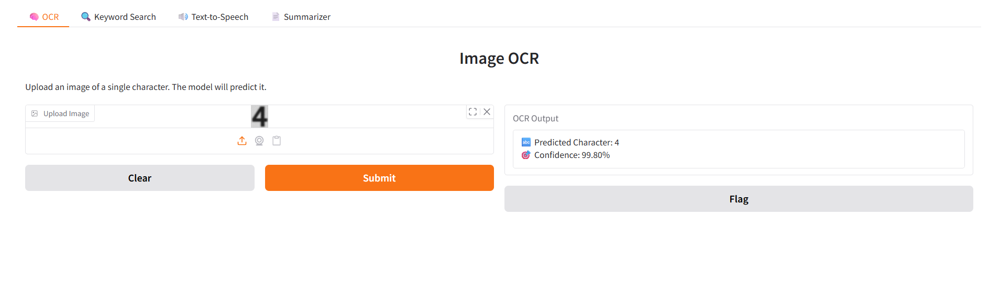
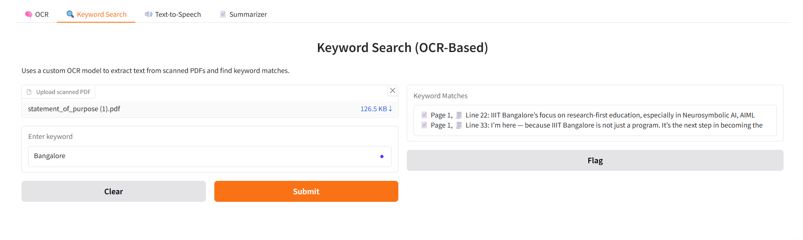
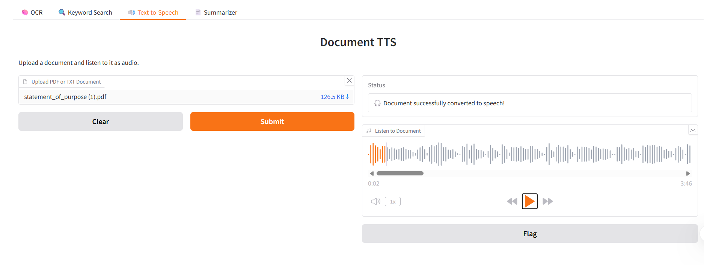
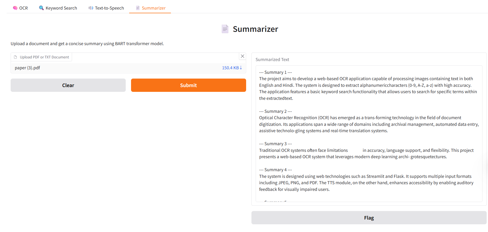

# 🧠 OCR & Document Search Web Application

A powerful **AI-based document analysis tool** with a **custom-trained OCR engine (ResNet CNN)** that supports **keyword search**, **text summarization**, and **text-to-speech (TTS)** — all accessible via an intuitive **Gradio interface**. No third-party OCRs used — *we built our own brain 🧠!*

---

## 🔍 Features

### 🧠 Custom OCR (ResNet CNN-based)
- PDF pages are converted to images using `pdf2image`.
- Images undergo preprocessing: binarization, thresholding, and character blob detection via OpenCV.
- Each character is cropped and passed to a **CNN model trained from scratch** on a dataset combining `0-9`, `A-Z`, and `a-z` (total ~21,000 images).
- Returns accurate text predictions — character-by-character and reconstructed line-by-line.

### 🔍 Keyword Search
- Implements a simple but effective Python logic to search user-given keywords.
- Only uses the **predicted text from the custom OCR model** (no external OCR like Tesseract or PaddleOCR used).

### 🧠 Summarization
- Employs **Facebook's BART (via Hugging Face pipeline)** to summarize large blocks of OCR-extracted text.
- Handles long documents by **chunking** them appropriately to stay within BART's token limit.

### 🔊 Text-to-Speech (TTS)
- Converts extracted/summarized text to **speech** using `gTTS` (Google Text-to-Speech).
- Allows users to **listen** to content on the fly — like an audiobook for your documents!

---

## ⚙️ Tech Stack

| Feature            | Library / Model Used            |
|--------------------|----------------------------------|
| OCR Model          | Custom CNN (ResNet-like)         |
| Image Preprocessing| OpenCV, NumPy                    |
| PDF → Image        | `pdf2image`                      |
| Summarization      | Facebook BART (`transformers`)   |
| TTS                | gTTS                             |
| UI Interface       | Gradio                           |
| Dataset            | 0-9, A-Z, a-z from multiple sources (21k images total) |

---


## 📁 Project Structure

```bash
.
├── main/
│
├── ocr_webapp/
│   ├── app.py              # Gradio interface
│   ├── ocr_model.py        # Custom OCR model loading & inference
│   ├── keyword_search.py   # Keyword search logic
│   ├── summarizer.py       # Text summarization using BART
│   ├── tts.py              # Text-to-Speech using gTTS
│
├── ocr_training/
│   └── ocr_training.ipynb  # CNN (ResNet-style) training notebook
│
├── dataset/
│   └── (0-9, A-Z, a-z)     # 21K labeled character images

```
---

## Skip Connections in ResNet
ResNet solves the vanishing gradient problem in deep networks.
- It introduces skip connections: the output of a layer is added to the output of a deeper layer.
- This ensures original information is retained, helps gradient flow smoothly, and speeds up convergence.
- In our OCR model, a lightweight ResNet-style CNN was used for character-level recognition.

⚠️ When using pre-trained ResNet models (e.g., for transfer learning), we typically freeze early layers (which extract general features like edges and textures) and fine-tune the later layers for task-specific adaptation.

## 💬 Why BART for Summarization?
- BART is a powerful sequence-to-sequence model pretrained on denoising and text generation.
- It supports abstractive summarization (generates new sentences rather than picking them from the input).
- Deployed via Hugging Face’s pipeline("summarization") — super easy to integrate.

## 🚀 Future Scope
- Add bounding box detection to switch from character-based to word-level OCR.
- Support multilingual documents using language-agnostic embeddings.
- Incorporate Named Entity Recognition (NER) to extract people, places, and organizations.
- Deploy via Hugging Face Spaces / Streamlit / Flask for public access.
- Optionally integrate voice-based query input using SpeechRecognition.

## 🎬 Demo
### 📽️ Screen Recording:
[▶️ Watch Demo](https://drive.google.com/file/d/18CgIOKvCjeyroPFnBN53CKDyW2QS-ZJq/view?usp=sharing)

## 🖼️ Screenshots:





## 💻 How to Run Locally
- git clone https://github.com/AnnapurnaKalmath/OCR-and-Multi-Function-Document-Processing-Prototype
- cd OCR-and-Multi-Function-Document-Processing-Prototype
- pip install -r requirements.txt
- python ocr_webapp/app.py

Gradio will launch your app in a browser tab.

## 🤝 Built With
- OpenCV for image processing
- [PyTorch / TensorFlow] for OCR model training (update based on what you used)
- Transformers by Hugging Face
- gTTS for audio output
- Gradio for front-end interface

## 🧠 Built By
- Annapurna N Kalmath
Final year ECE undergrad | Aspiring AI-Neuroscience researcher
- And awesome teammates Divya Bhagwat, Prathibha Angadi and Ashwini Hadagali
